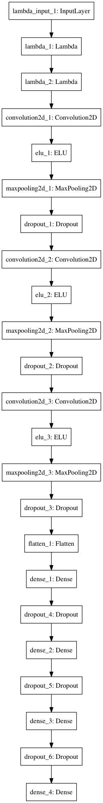

# CarND-P3-Simulator

## Overview

* [Model Diagram](#model-diagram)
* [Network Architecture](#network-architecture)
* [Augmenation And Recovery](#augmenation-and-recovery)
* [Dataset](#dataset)
* [Prediction](#prediction)

## Model Diagram

## Network Architecture

> __Resizing__
> 
> Images are resized in the Generator.  Attempts were made to add a **lambda** resize layer but were unsuccessfull. 

The first two layers of the network perform __normalization__ and __trimming__.    Images passed to the input layer via the __Generator__ are resized in to __(64, 64)__.

The model has __3__ layers of convolusions.  Each layer is __ELU__ activated and __(2x2) max pool'd__.  

There are 3 __Fully Connected__ layers; having __1024__, __128__, and __64__ neurons respectively.

A __dropout__ is added to every layer in the network with a __0.5__ keep probablity.  Regularization via a __dropout__ at the convolusional layers help to prevent interdepencency between convolusions, and improve the validity regression at the fully connected layers.

## Augmenation And Recovery

Left and right cameras are used to peform recovery.  The angle of the center camera is adjusted with a __+/- 0.15__ to reposition the car back into center.

The following augmentations and data manipulations are perfomed

1. All __zero__ angle images are dropped; however their __+/- 0.15__ equivelants are kept.
2. All images are resized to __(64, 64)__.
3. Images with angles greater than __0.5__; with the exception of the recovery images, are randomly shifted to the right and left.
3.1. A random uniform of __+/-1__ decides which direction to shift; __right/left__ respectively.
3.2. A random uniform of __10/50__ shifts the image in either direction using __cv2.getAffineTransform__
3.3. The angle is __+/-__ adjusted by a factor of __0.004__ for each pixel.  This helps to train the model on additional positions of the car on the track.
4. Images with a angle greater than __0.15__ are flipped horizontally for additional training on right turns since the track is mostly left turns.

## Dataset

The Udacity.com dataset provided back in late November was used in additional to some training examples recorded via a __PS4__ controller at locations where there are sharp turn.

## Prediction

The models's weights are saved at the end of each epoch.  The weights with the lowest __validation loss__ are used at prediction during autonomous simulator runs.

